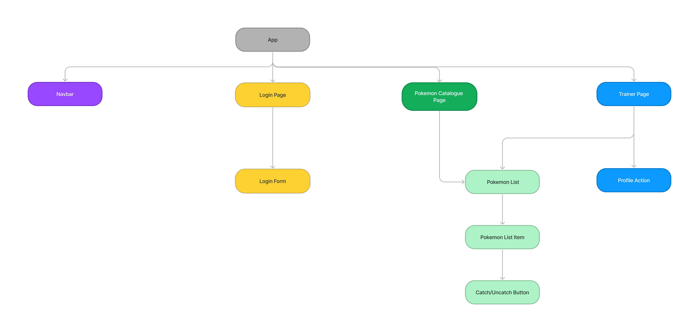

# PokemonTrainer
The application is written in Angular. It is connected to a API using JSON-server which is hosted by the platform Railway. As a styling tool the application uses Tailwindcss.

## Dependencies
- angular ^15.1.0
- rxjs ^7.8.0
- postcss ^8.4.21
- tailwindcss ^3.2.4

## Features
This section declares the applications functionality.

### Login Page
The login page handles all logic regarding logging in, creating a session storage and creating new users.

### Pokémon Catalogue Page
The pokémon catalogue page fetches 20 pokémons from an API and displays their name and an image of the pokémon to the user. The user are also able to catch pokémons that are not already caught by pressing a button. This page is guarded and not accessible unless you´re logged in.

### Trainer Page
The trainer page displays all the users caught pokémons. This page is guarded and not accessible unless you´re logged in.

## File structure
This section will describe the projects file structure. All components has it own `.ts` and `.html` file.

### app
Basically all the written code is found in the app folder. It is structured as the headers indicates. Apart from them it also contains component files as well as the `module` - declares all components and imports all modules - and `routing.module` - handles all the routes - file.

#### components
In the component folder contains all components with corresponding folders. The component tree shows there internal structure. 

#### enums
In the enums folder the storage keys are saved.

#### guards
The guards folder contains the authentication guard.

#### models
The models folder contains as the name implies the models, in this case one for a pokémon and one for a trainer.

#### pages
The page components is stored in the pages folder. These are also shown in the component tree.

#### services
The applications services are store in the services folder. For this application these are; `catch`, `login`,`pokemon-catalogue`, `pokemon` and `trainer`. They handle state handling, fetch calls and all complex logic.

#### utils
The utils folder contain all the util for this application this is a storage util which sets and reads sessions.

#### Component tree
This is the internal structure of the components for this application. Navbar is available all over the application. Pokemonlist, pokemonlist item and catch btn are used both by the Trainer page and Pokemon Catalogue page.

## Description
The third assignment in the class Java Fullstack Remote Nordics Jan 23 hosted by Noroff for learning Angular.

### Authors
- Erik Hanstad
- Erik Brandt

# Getting started with Angular app
This project was generated with [Angular CLI](https://github.com/angular/angular-cli) version 15.1.3.

## Development server

Run `ng serve` for a dev server. Navigate to `http://localhost:4200/`. The application will automatically reload if you change any of the source files.

## Code scaffolding

Run `ng generate component component-name` to generate a new component. You can also use `ng generate directive|pipe|service|class|guard|interface|enum|module`.

## Build

Run `ng build` to build the project. The build artifacts will be stored in the `dist/` directory.

## Running unit tests

Run `ng test` to execute the unit tests via [Karma](https://karma-runner.github.io).

## Running end-to-end tests

Run `ng e2e` to execute the end-to-end tests via a platform of your choice. To use this command, you need to first add a package that implements end-to-end testing capabilities.

## Further help

To get more help on the Angular CLI use `ng help` or go check out the [Angular CLI Overview and Command Reference](https://angular.io/cli) page.
